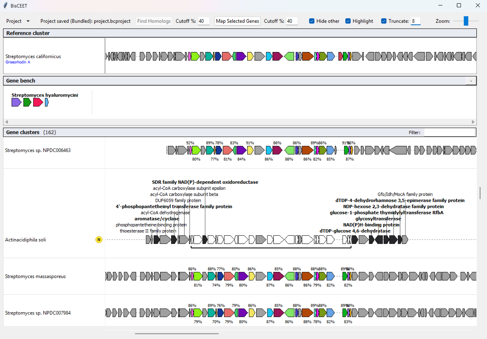

# BisCEET

**Bi**o**s**ynthetic Cluster **E**nvironment **E**xamination **T**ool

BisCEET is a Python/Tkinter desktop application for visualizing, comparing, and analyzing biosynthetic gene clusters from GenBank files. It enables researchers to identify homologous genes across multiple clusters and explore gene organization patterns with focus on visualization of core biosynthetic genes and additional biosynthetic genes.



## Features

- **GenBank Import**: Load and visualize multiple `.gb`/`.gbk` files simultaneously
- **Reference Cluster Pinning**: Pin a cluster as a reference for comparative analysis
- **Gene Mapping**: Color-coded visualization of homologous genes across clusters
- **Core Gene Detection**: Identify genes conserved across specified clusters
- **Gene Bench**: Collect and organize genes of interest from different clusters
- **Interactive UI**: 
  - Drag clusters to align gene positions or use the "Visually align" function
  - Flip cluster orientation
  - Zoom and pan navigation
  - Expandable rows for detailed gene labels
- **Annotations**: Add custom notes, product names, and alternative gene names
- **Project Save/Load**: Save your analysis state as `.bcproject` files
- **Export**: Export selected clusters to GenBank format
- **External Links**: Direct links to NCBI BLAST and GenBank for selected genes

## Installation

### Prerequisites

- Python 3.8 or higher
- Tkinter (usually included with Python)

### Install Dependencies

```bash
pip install -r requirements.txt
```

Or install directly:

```bash
pip install biopython>=1.79
```

### Run the Application

```bash
cd source
python BisCEET.py
```

## Usage

### Quick Start

1. **Load Clusters**: Click "Open Files" to import GenBank files (`.gb`, `.gbk`)
2. **Set Reference**: Right-click a cluster → "Pin as Reference"
3. **Select Biosynthetic Core Genes**: Select genes in the reference cluster from the context menu manually. Alternatively, use the "Mark Cluster" function to select gene clusters in the list and then "Select Homologs from Marked Clusters".
4. **Run Mapping**: Click "Map selected genes" to find homologs across all clusters
5. **Explore Results**: Homologous genes in the list of clusters are colored to match their reference gene. Select "Inspect view" from the context menu to view the clusters in a detailed view with visual focus on potential non-core biosynthetic genes.

### Key Controls

| Action | Control |
|--------|---------|
| Drag individual cluster | Click + drag on cluster |
| Drag all clusters | Click middle mouse button + drag on cluster |
| Flip cluster orientation | Double-click on cluster |
| Zoom | Use zoom slider |
| Context menu | Right-click on cluster or gene |

### Gene Bench

The Gene Bench allows you to collect genes from any cluster for comparison or enter your own genes as Protein sequences:
1. Right-click a gene → "Add to Gene Bench"
2. Toggle the Gene Bench panel ("+" button in the toolbar)
3. Select genes in the Gene Bench and run "Map gene bench" for alignment

## License

This project is licensed under the MIT License - see the [LICENSE](LICENSE) file for details.
